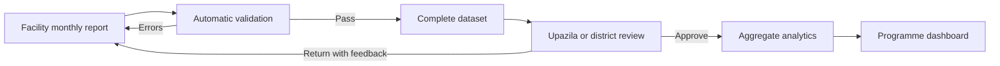

# DHIS2 Malaria Aggregate Reporting Case Study

A privacy-safe portfolio implementation of a monthly malaria reporting workflow for DHIS2. It demonstrates requirements analysis, aggregate metadata design, data-quality controls, indicator definitions, reporting workflows, and dashboard planning using reproducible synthetic data.

> **Independent demonstration:** This project is not an official implementation of DHIS2, PATH, WHO, NMEP, BRAC, the Government of Bangladesh, or any other institution. Every record is synthetic and must not be used for operational or clinical decisions.

## What this project demonstrates

- A four-level organisation-unit design for facility reporting and review
- A monthly aggregate dataset with 17 reporting variables
- Transparent malaria programme indicators
- Data-entry validation and quality-review rules
- A role-aware submission, review, and analysis workflow
- A proposed executive dashboard using indicators, charts, tables, and maps
- DHIS2-compatible long-format synthetic data values
- Reproducible generation and automated integrity tests

## Intended users

| User | Primary need |
|---|---|
| Facility data-entry user | Enter, validate, and complete a monthly report |
| Upazila/district reviewer | Review completeness, resolve errors, and approve reports |
| National programme analyst | Compare trends, locations, incidence, and data quality |
| System administrator | Maintain metadata, access, sharing, backups, and imports |

## Reporting flow



## Repository contents

```text
data/       Generated wide analysis data and DHIS2 long data-value import file
docs/       Design, indicators, validation rules, workflow, and implementation guide
metadata/   Configuration blueprint and guidance for producing a real DHIS2 export
scripts/    Deterministic synthetic-data generator
tests/      Automated privacy and consistency checks
```

## Generate and test the demonstration data

Requires Python 3.10 or later and no third-party packages.

```bash
python3 scripts/generate_synthetic_data.py
python3 -m unittest discover -s tests -v
```

## Run the analytical dashboard

```bash
python3 -m venv .venv
source .venv/bin/activate
pip install -r requirements.txt
streamlit run app.py
```

The dashboard provides filters, programme KPIs, monthly trends, facility comparisons, case-origin analysis, reporting-completeness review, and a download of the selected synthetic records.

The generator creates:

- `data/synthetic_malaria_monthly.csv`: human-readable analytical dataset
- `data/dhis2_data_values_long.csv`: `dataElement,period,orgUnit,value` layout

Both outputs use fictional UIDs. Do not import them into an operational instance.

## Configuration scope

The proposed package contains:

1. Organisation units and levels
2. Data elements and dataset sections
3. Category combinations where disaggregation is justified
4. Indicator types and indicators
5. Validation rules and a validation-rule group
6. Dataset completion and approval workflow
7. User groups and sharing design
8. Visualizations and an executive dashboard

See [implementation guide](docs/implementation-guide.md) for the safe build and export sequence.

## Dashboard specification

The proposed **Malaria Programme Overview** dashboard contains:

- Confirmed cases, test positivity, deaths, and reporting completeness headline values
- Confirmed cases by month
- Incidence per 1,000 population by organisation unit
- Test positivity by facility
- Indigenous versus imported case mix
- Parasite species distribution
- Reporting-completeness table
- Stock-out monitoring table
- Validation issues requiring review

Analytical outputs should use indicators and relative periods/organisation units to make them portable.

## Privacy and responsible use

- No person-level or patient-level variables are included.
- No household coordinates, names, phone numbers, or identifiers are included.
- Facility names and all values are fictional demonstrations.
- No production DHIS2, BRAC, NMEP, EWARS, PATH, or partner data may be added.
- The design is an educational case study, not a diagnostic or outbreak-warning tool.

## Current status

- [x] Requirements and scope
- [x] Organisation-unit and data model
- [x] Indicator and validation specifications
- [x] Reproducible synthetic data
- [x] Automated data-integrity checks
- [x] Runnable analytical dashboard
- [ ] Configure in a blank DHIS2 test instance
- [ ] Capture configuration screenshots
- [ ] Export dependency-aware metadata JSON
- [ ] Run metadata import validation/dry run
- [ ] Add the validated export and import report

## Author

**Khalilur Rahman Ridoy Khan**  
Full-Stack Engineer · Data Analyst · Health Information Systems Professional
